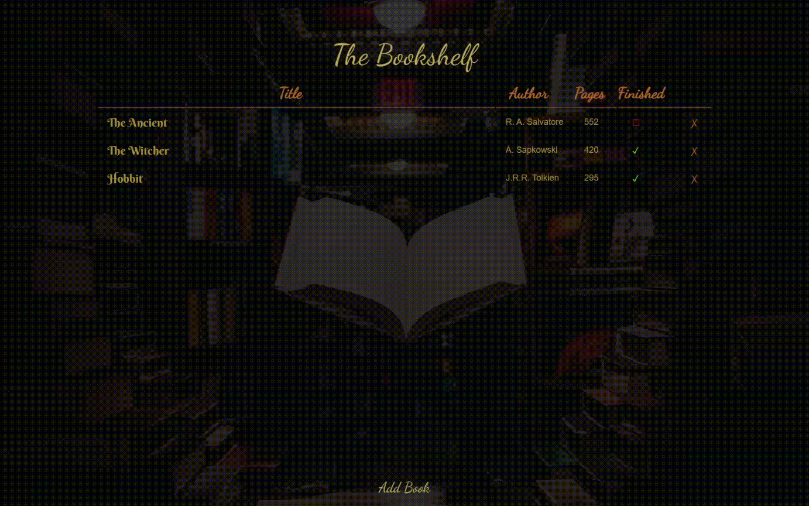

# Virtual Bookshelf
[Take me to the bookshelf!](https://bookshelf-library-wb.web.app/)

[Show me old version](https://wblachut.github.io/Bookshelf_TheOdinProject/) with LocalStorage.
##
## PROJECT: LIBRARY

Project is a part of The Odin Project [JavaScript learning curriculum](https://www.theodinproject.com/courses/javascript). To learn more open the [TOP assignment](https://www.theodinproject.com/courses/javascript/lessons/library).

## Description

A small library app. Books are created as `class` objects and stored in a Library array. This project allowed to grow knowledge of object usefulness in JS and using `LocalStorage` and BaaS for storing data. Update to [Firebase](https://firebase.google.com/) allows users to log in with `Google` account to track user-specified library data. Therefore, the gif below is deprecated. Following Firebase options were applied:

* [Firebase Hosting](https://firebase.google.com/docs/hosting)
* [Firebase Authentication](https://firebase.google.com/docs/auth) 
* [Cloud Firestore](https://firebase.google.com/docs/firestore)
#

## Concepts used and learned:

* GitHub pages hoisting
* ES6 Modules
* DOM manipulation
* Object Constructors and Classes
* Factorials
* Prototypal Inheritance
* LocalStorage
* BaaS (Firebase)

## Tools:

* Visual Studio Code
* Javascript
* CSS3
* HTML5
* Firebase

## Some ideas to apply in the future:

- [X] use Firebase instead of LocalStorage
- [ ] add transitions for creating a book
- [ ] add times read column
- [ ] add percentage display bar for pages already read in the book (IA idea)
